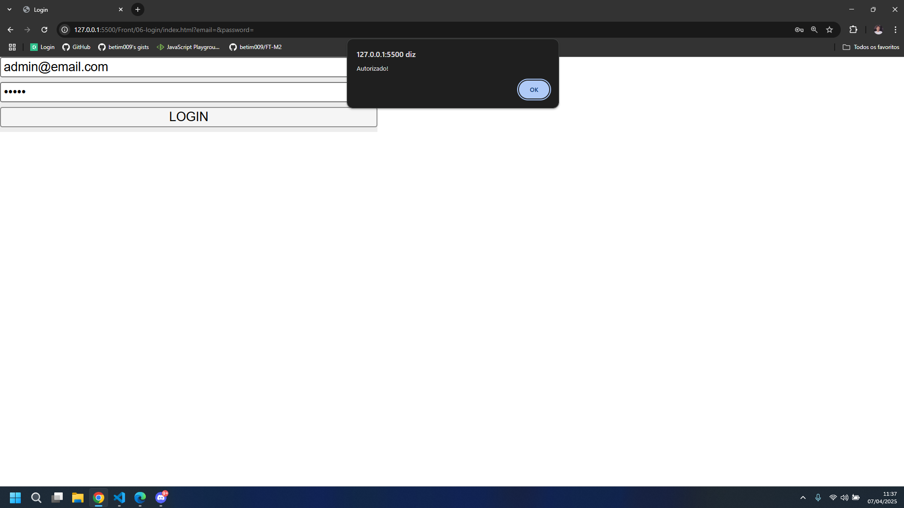

# Desafio: Validação de Login com JavaScript

## Objetivo

Neste desafio, você vai criar um sistema simples de validação de login.  
O usuário deve digitar um e-mail e uma senha e, ao clicar em "Entrar",  
o sistema deverá verificar se os dados estão corretos e mostrar uma mensagem na tela.

---

## Etapas do desafio

### ✅ Etapa 1: Selecionando os elementos HTML

- Use o `document.getElementById()` para capturar:
  - O formulário (`<form>`)
  - O campo de e-mail
  - O campo de senha

Guarde cada um deles em uma variável.

---

### ✅ Etapa 2: Criando o comportamento ao enviar o formulário

- Adicione um evento com `addEventListener` no formulário.
- Esse evento deve escutar o `"submit"`.
- Use `event.preventDefault()` para impedir que a página recarregue.

---

### ✅ Etapa 3: Verificando os dados

- Dentro do evento, verifique se:
  - O valor do campo de e-mail é `"admin@email.com"`
  - E o valor do campo de senha é `"admin"`

Use um `if` para isso.

---

### ✅ Etapa 4: Mostrando mensagens

- Se os dados estiverem corretos:
  - Exiba um `alert("Autorizado!")`

- Se os dados estiverem incorretos:
  - Exiba um `alert("Não autorizado!")`
  - Limpe os dois campos, deixando-os vazios novamente.

---

## Dica extra 💡

- Para acessar o valor digitado em um input, use `input.value`.

---

## Exemplo visual (gabarito)

Boa sorte! 🚀
